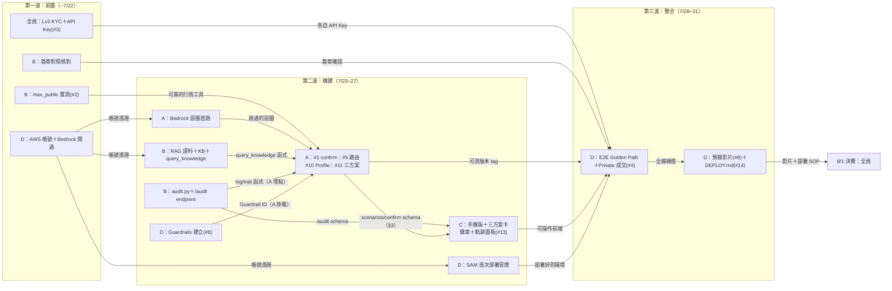

# MaiMate 麥麥 — 總覽與索引

> 2026 雲湧智生黑客松｜MaiCoin 智慧理財命題｜隊伍「第五名」
> **本檔是進入點：分工、時程、API 契約、驗收與商業模式在這裡；技術細節在下表三份文件。**
> 決賽 8/1–8/2｜評分：創意25／可行20／商業20／AI設計15／切合10／完成10＋Lv2 Private API +5＋Kiro +5

[](https://github.com/giont565/MaiMate/actions/workflows/ci.yml)

**一句話**：別的投資工具看「市場」，MaiMate 同時看「你」——AI 讀你一年 10,000 筆交易紀錄找出行為盲點，
結合 MAX 即時行情給個人化洞察，在你明確授權下執行交易。**洞察 → 對話 → 行動，AI 有手，方向盤在人手上。**

## 文件索引

| 我想… | 看這份 |
|---|---|
| **30 分鐘把它跑起來**（不用 AWS、不用金鑰） | [docs/ONBOARDING.md](docs/ONBOARDING.md) |
| 搞懂系統怎麼組起來的、程式在哪 | [docs/ARCHITECTURE.md](docs/ARCHITECTURE.md) |
| 看合規怎麼設計的、**還缺什麼** | [docs/COMPLIANCE.md](docs/COMPLIANCE.md) |
| 部署到 AWS | [docs/DEPLOY.md](docs/DEPLOY.md) |
| 部署完驗收 | [docs/TEST_CHECKLIST.md](docs/TEST_CHECKLIST.md)＋`npm run verify:ui -- --base <網址>` |
| 演 Demo | [docs/DEMO_SCRIPT.md](docs/DEMO_SCRIPT.md) |
| 只有人能做的交付項（截圖、KYC） | [docs/CAPTAIN_TODO.md](docs/CAPTAIN_TODO.md) |
| **看每個功能的規格怎麼定的**（Kiro spec-driven） | [`.kiro/`](.kiro/)：steering×5＋specs×8 |
| **改介面**（跨包契約） | 本檔 §3 —— 改前先在 #dev 廣播 |

> 三份技術文件（ARCHITECTURE／COMPLIANCE／ONBOARDING）的每一條主張都附 `檔案:行號`，
> 可自行 `git grep` 覆核。與本檔牴觸時以那三份為準；與程式碼牴觸時以程式碼為準。

## 0. 設計圖

| ① 健檢首屏 | ② 恐慌攔截＋三方案 | ③ 確認→成交→軌跡 |
|---|---|---|
|  |  |  |

吉祥物：麥麥像素機器人（`docs/brand/`，IDLE/BLINK/BULLISH 三態，胸口 K 線）。
mockup HTML 在 `docs/mockups/`＝C 包前端起點，畫面中所有數字皆真實資料計算。

**產品化路徑的可點示意**：`frontend/host-app.html` — 模擬 MAX／MaiCoin App 首頁多一個麥麥 icon，
點下去麥麥就在 WebView 裡跑起來，左上角保留返回宿主 App 的箭頭。把 §2「主交易系統零改動」
從一句話變成評審自己能點的東西。（宿主畫面為示意 wireframe，畫面上有常駐標示。）

---

## 1. 開發地圖

### 時間軸（原則：賽前做完，決賽 30 小時只上架）

| 階段 | 日期 | 目標 | 實際 |
|---|---|---|---|
| 定案與就位 | ～7/22 | 全員 KYC(#3)、Kiro 設定、選包、AWS 帳號定案 | 達成 |
| 核心構建週 | 7/23–27 | Golden Path 全鏈路＋RAG＋手機版 | 達成 |
| 整合排練週 | 7/28–30 | E2E、離線備援、預錄影片 v1、簡報定稿 | 達成；**#4 真實成交在 7/29–31 打通**（六個坑，見 §4.5） |
| 凍結日 | 7/31 | code freeze、DEPLOY.md 定稿、從零部署演練 | 演練實測 **46 分鐘** |
| 決賽 | 8/1–8/2 | 官方環境重部署、現場調整、最終錄影、上台 | 官方環境已部署；前端改版後 8/2 重錄主片 |

### 四個工作包 × 實際交付

標記：✅ 已交付且有實測證據｜⬜ 未完成（原因寫在後面，不留白）。每包獨佔目錄，git 不打架。

**A｜Agent 與方案引擎**（地盤 `backend/agent/`）
- ✅ Bedrock Converse 工具迴圈（8 輪上限、Haiku/Sonnet 意圖路由）
- ✅ tools dispatch／程式層護欄／prepare-execute 分離 單元測試
- ✅ #1 confirm 卡帶出前端｜✅ #10 Profile 引擎｜✅ #11 三方案計算
- ✅ 進場方式比較（`compare_entry_strategies`，回測資料源獨立於命題 CSV）
- ✅ 註冊 B 交付的 `query_knowledge`／loop 埋 audit 點
- ⬜ 掛載 Bedrock Guardrails（#6，見 §4.9 說明為何刻意不啟用）

**B｜資料服務與 RAG**（地盤 `backend/integrations/` `analysis/` 語料）
- ✅ #9 RAG 語料蒐集（防詐公開資源＋教材；不進 git）
- ✅ #9 Bedrock KB＋S3 Vectors 建置｜✅ #9 `query_knowledge` 函式
- ✅ #12 `audit.py`＋`GET /audit` endpoint（A 埋點、C 面板）
- ✅ #2 max_public 三 endpoint 實測（ticker/kline/depth 對官方文件核對＋正規化）
- ✅ max_private 簽章實作（真實成交兩筆為證，見 §4.5）
- ✅ thirdparty CMC 冒煙（BTC/TWD 真實 API 驗證；重跑見 `scripts/verify_cmc_smoke.py`）

**C｜前端與品牌**（地盤 `frontend/` `docs/mockups/` `docs/brand/`）
- ✅ #13 手機版 RWD（照 mockups 三畫面實作）｜✅ #26 健康分 hero 卡
- ✅ 三方案卡渲染｜✅ 模式徽章＋Demo 切換｜✅ 決策軌跡面板｜✅ 成交切 BULLISH
- ✅ #28 Onboarding 五屏｜✅ 離線 mock 拔網路實測（fallback＋UI 離線標示）
- ✅ 12 組煙測腳本（`scripts/smoke_*.js`，CI 每次 push 跑）

**D｜整合部署與交付**（地盤 `infra/` `docs/`）
- ✅ AWS 帳號＋Bedrock 開通｜✅ SAM 部署＋Lambda×5 冒煙
- ✅ #14 從零部署演練＋DEPLOY.md（**實測 46 分鐘**，目標 <60 分）
- ✅ #4 Private API E2E 最小額度真實成交｜✅ 憑證過期/重放 410
- ✅ E2E Golden Path｜✅ 官方環境重部署（Lambda 金鑰待補，issue #70）
- 🟡 #8 Demo 錄影：08-02 前端改版後主片鏡 1–5／7／8 已重錄，尚有四項待決（issue #75）
- ⬜ #6 Guardrails 主控台建置（同 A 包最後一項）
- ✅ #15 Kiro 證據截圖 F–J：08/02 由隊友以 Kiro IDE 拍齊，存受限 Drive（issue #42 已關）

**全員共同**：#3 自己的 Lv2 KYC＋API Key、Kiro 設定、過程截圖存 Drive、每天合回 main。

### 交棒地圖：哪個工項完成，交付給誰

三波推進；箭頭上是交付物。看自己的包：進來的箭頭＝你在等什麼，出去的箭頭＝誰在等你。



文字版四大交接（背這四條就夠）：**B→A** 函式交付｜**A→C** schema（§3 已定義，C 可先用假資料）｜
**D→A** Guardrails ID｜**A→D** 可測版本 tag（E2E 開跑訊號）。
其中 **Guardrails 這條最後沒有交付**——原因寫在 §4.9，不是忘了。

**不打架五規則**：①地盤制（動別人目錄→開 issue）②介面契約先行（見 §3，C 包用假資料平行開發）
③共用檔單一 owner（tools.py/loop.py 歸 A、infra 歸 D）④每日 pull --rebase 合回 main ⑤改介面先在 #dev 廣播。

### Kiro：spec 先行的開發方式

每個功能都走同一條路，**規格先於程式碼**：

```
.kiro/specs/<feature>/
  requirements.md   User Story ＋ EARS 格式驗收條件（WHEN…THEN…SHALL）
  design.md         架構、元件、關鍵取捨與為什麼這樣選
  tasks.md          可逐項勾選的任務；沒實際跑過的不准打勾
```

`.kiro/steering/` 的五份約定（product／tech／structure／workflow／data-schema）**每次對話自動載入**——
所以「永不報明牌」「`execute_order` 不進工具清單」這些紅線不是靠人記得，
而是每一次生成都被餵進去。用其他 AI 工具開發時，把 `workflow.md` 連同任務一起餵給它，紀律一致。

**credit 紀律**：2000/人只發一次——練習≤300／開發~1000／決賽保底≥700；
Autopilot 只在跑定義好的 task 時開；過程截圖（Specs 面板／task 執行／MCP）存 Drive 當 +5% 證據。

---

## 2. 產品與商業

> **技術架構已移到 [docs/ARCHITECTURE.md](docs/ARCHITECTURE.md)**（含系統圖、五支 Lambda、
> 工具清單、三道安全設計，全部附 `檔案:行號`）。本節只留 pitch 需要的產品與商業內容。

三十秒版本：靜態前端（S3+CloudFront）→ API Gateway → 五支 Lambda → `/chat` 進 Bedrock
Converse 工具迴圈。**金融數字一律由確定性程式計算，LLM 只負責理解、整合、解釋。**
安全靠三件 AI 做不到的事：下單函式不在工具清單、下單憑證 60 秒過期、每步留 audit。

### Golden Path（決賽 Demo 主線，90 秒）

「ETH 跌太多幫我全賣」→ 查持倉54%→查行情→查歷史（1/8 少賺 31 萬）→判定模式→**三方案**（賣25%/全賣/暫停，
含損益/手續費/集中度）→ 使用者選 → **確認卡**（60s 憑證）→ 按確認 → `/order` 驗證銷毀憑證 → MAX Private 成交
→ 健檢更新 → 點開**決策軌跡**面板。全程 Audit 留痕。任一步掛掉→離線 mock 接手；全掛→預錄影片。

### 模型與成本

| 工作 | 模型 | 成本 |
|---|---|---|
| 日常對話＋工具調度 | Claude Haiku（Bedrock） | ≈NT$0.3/次 |
| 深度歸因＋方案解釋 | Claude Sonnet（Bedrock） | ≈NT$2.2/次 |
| 混合平均（＋prompt caching 一折） | — | **<NT$0.6/次** |

省錢三決策：S3 Vectors（避開 OpenSearch 月費萬元陷阱）／全 serverless（零閒置費）／模型分層＋快取。
**價值錨點：此帳戶平均每筆賣出機會成本 NT$11,480——一年攔一筆衝動交易＝16 年 AI 成本。**
全隊賽前總花費 <NT$500；千人規模基礎設施 <NT$3,000/月。單價以 AWS 主控台現價估算。

### 商業模式：平台怎麼賺錢（不是只幫客戶省）

交易所的收入核心是**成交手續費**（MAX 現貨基礎費率：掛單 0.08%／吃單 0.16%，MAX Token 折抵 -30%、推薦碼前 6 個月 -20%，VIP 另有優惠；以官網公告為準）。
MaiMate 的每個功能都直接推動這台收費機器：

| 收入線 | 機制 | 量化（估算，標注假設） |
|---|---|---|
| **① 手續費放大（今天就在收）** | 新手「看不懂→不敢交易」→ MaiMate 陪跑出第一筆單；恐慌全賣離場的用戶 LTV 歸零 → 攔住＝保住未來手續費年金；MaiCoin 買賣平台 → MAX 交易所升級（更深交易場景） | 中階散戶月交易額 NT$50 萬 → 平台月收 NT$250–750/人；本資料集這種年 4,674 筆的活躍戶，流失一個平台一年少收上萬到數十萬 |
| **② 冷靜期 → 定期定額導流** | 三方案的「暫停」不是不賺——導向 MaiCoin 既有 DCA 產品，把衝動單轉成長期定投：穩定費流＋資產沉澱 | 衝動交易的手續費是一次性的；DCA 是年金 |
| **③ Premium 訂閱（第二曲線）** | 進階分析：損益歸因、年度健檢、即時行為提醒 | 月費 NT$99–199；假設 10 萬活躍用戶滲透 5% ＝ 月收 NT$50–100 萬 |
| **④ B2B 白牌（第三曲線）** | 行為引擎＋合規 Agent 框架授權其他交易所／銀行財管 | 授權費＋分潤；台灣 VASP 專法後合規需求放大 |

**單位經濟學一句話**：重度用戶 AI 成本 <NT$60/月；用戶月交易額只要 NT$4 萬（taker 0.16%）手續費就回本——
而 MaiMate 存在的目的就是提高交易頻率與留存。**留存率每提高 1%，手續費增量遠大於整個 AI 帳單。**

上台順序建議：先講 ①（評審是交易所的人，手續費語言最直接），再用 ③④ 展示想像空間。

### 部署策略（8/1 公布官方 AWS 環境的應對）

賽前自家帳號全跑通 → 一切設定走環境變數（零硬編碼）→ 7/31 前完成從零部署演練（目標<1hr，寫成 DEPLOY.md）
→ 決賽當天官方環境重跑腳本＝上線。

### 產品化整合路徑（未來架構：獨立 sidecar，不塞進主程式）

**一句話：MaiMate 是掛在交易所旁邊的獨立 AI 服務（sidecar），不是塞進主交易系統的模組——
升級迭代不動核心系統，這是可行性與合規的雙重賣點。** 黑客松版與產品版是同一套後端，只換入口與帳號整合：

| 階段 | 入口 | 帳號/資料 | 下單 | 主系統改動 |
|---|---|---|---|---|
| 黑客松（現況） | 獨立 Web（S3+CloudFront） | 官方 CSV 預計算＋使用者 API Key | MAX Private API＋逐筆確認 | 零 |
| 產品化 | MaiCoin/MAX App 內嵌（WebView 或原生「麥麥」分頁），前端即現有 SPA | 平台 OAuth 授權取代自填 API Key；健檢改讀平台交易史 API | 不變（仍走既有 Private API＋逐筆確認） | 零——只加一個入口 |
| B2B 白牌 | 客戶自有 App | 多租戶部署，語料/Guardrails/品牌可換 | 各交易所自有 API | 零 |

邊界原則（合規敘事同 §4.9）：MaiMate 全程只做「讀資料＋產草稿＋留稽核」，execute 永遠隔離在 LLM 之外、
由使用者逐筆確認觸發——所以它可以貼著任何交易系統跑，審計邊界天然清晰。

---

## 3. API 介面契約（套件間交接唯一依據；改介面先在 #dev 廣播）

### POST /chat

Request：
```json
{ "messages": [ {"role":"user","content":[{"text":"..."}]} ], "mode": "growth", "session_id": "uuid" }
```
Response：
```json
{
  "reply": "AI 回覆文字",
  "messages": [ "...完整 Converse 歷史，前端原樣保存回傳..." ],
  "confirm": { "confirm_token": "uuid",
    "confirmation_card": { "market":"ethtwd","side":"sell","volume_twd":35920,"ord_type":"market","price":null } },
  "scenarios": [ { "key":"partial","label":"賣出 25%","amount_twd":35920,"fee_twd":54,
    "post_concentration_pct":44,"behavior_note":"..." } ],
  "tool_trail": [ {"seq":1,"tool":"get_account_balance","summary":"ETH 54%"} ]
}
```
`confirm` 僅在產生下單草稿時出現；`scenarios` 僅在方案試算時出現；`tool_trail` 供前端工具鏈 chips。

### GET /health?section=all|chase_index|...
Response＝`data/health_report.json` 對應區塊（欄位定義：`.kiro/steering/data-schema.md`）。

### LLM 工具 `compare_entry_strategies`（無獨立 HTTP 端點，經 /chat 觸發）

Input：`{ "market": "btctwd", "amount_twd": 50000, "risk_mode": "cautious|growth|pro" }`
Output：三種進場方式（`lump_sum` / `dca` / `grid`）在 `uptrend`／`downtrend`／`sideways`
三情境的 `return_pct`、`max_drawdown_pct`、`end_cash_pct`，加上按 `amount_twd` 換算的 TWD 金額、
`full_period_grid_vs_hold`、`feasibility`（每份是否高於交易所單筆下限）、`key_findings`、`data_notes`。

資料源＝`analysis/strategy_compare.py` → `data/strategy_report.json`（**MAX 公開日線，非命題 CSV**——
命題 CSV 的價格路徑全年最大回撤僅 0.6%~3.6%，跑策略回測會得到假結論）。
`risk_mode` 只決定 `risk_tier.primary_metric`（先看哪個數字），**不決定推薦誰**；
三種方式一律對等呈現，違反即踩紅線 1（`tests/test_strategy_compare.py` 守這條）。

### GET /market?market=btctwd&kind=ticker|kline|depth
Response：`{ "kind","market","fetched_at_utc","fetched_at_taipei","data":{...} }`（2026-07-21 改版）
ticker 的 `data` 為 MAX 原始回應；kline 的 `data` 已由程式正規化為具名 OHLCV（由舊到新）：
`[{"timestamp","time_utc","time_taipei","open","high","low","close","volume"}]`
——`time_utc`/`time_taipei` 為權威時間，消費端（含 LLM）不得自行換算 Unix timestamp。
depth 的 `data` 已正規化（asks 低→高、bids 高→低）並附確定性計算欄位：
`best_ask`/`best_bid`/`spread_twd`/`spread_pct`——價差由程式算好，LLM 不得自行計算。

### GET /behavior（用**使用者自己的**成交紀錄算行為健檢）
`/health` 那份是命題方提供的示範帳戶；本端點改用 MAX Private 的真實成交紀錄重算
`chase_index`／`opportunity_cost`／`activity_profile`（同一套算術，重用 `analysis/precompute.py`）。
- 機會成本改以**當下市價**為基準（語意是「賣掉之後到現在少賺多少」），與 `/health` 的年末價基準不同，`data_notes` 會講明
- 預設**有界**：每個市場只取最近一頁（1000 筆）；此模式**不出已實現損益**——
  移動平均成本法要從第一筆買入算起，截斷歷史會產出看起來具體、實則無意義的數字
- 沒有 MAX 金鑰的環境回 **409**（`no_account_keys`）並指向 `/health`，
  **不拿示範資料冒充真帳戶**；取不到紀錄回 503
- 診斷參數：`?markets=eth,btc`、`?pages=N`、`?full=1`（僅賽後驗證用）

### POST /order
Request：`{ "confirm_token","session_id" }`。成功：`{ "ok":true,"order","exchange_response" }`；
失敗 HTTP 410：`{ "ok":false,"code":"token_expired","message","retryable":false }`

### GET /audit?session_id=
Response：`{ "trail":[{"seq","ts","type":"tool_call|draft_created|user_confirmed|executed","payload"}] }`

---

## 4. 完整驗收項目

### 4.1 行為分析引擎（behavior-engine）｜B 地盤 — ✅ 全數通過（真實資料驗證）
- [x] 10,000 筆全數解析（欄位尾端空白 strip）
- [x] 追高 65.0%（2,350 筆買入）／殺低 34.1%（2,304 筆賣出）
- [x] 機會成本總額 NT$26,598,877；最痛單筆 2025-01-08 DOGE NT$312,924
- [x] 峰值集中 2025-12 twd 98.6%（最大持有是**現金**，文案須講明）；提領僅 14.2% 於下跌後
- [x] 已實現損益 **+117,482**（981 勝／493 負）；最痛真實虧損僅 **963**（2025-10-01 USDT）
- [x] 對外標示為「命題方提供的示範帳戶」，不是使用者本人的帳戶
- [ ] 分年度投資報酬率（issue #47）：CSV 缺年初市值與出入金脈絡，硬算會誤導，因此不先出數字

### 4.2 對話 Agent（chat-agent）｜主責 A（E2E 驗證：D）— ✅ 線上實測通過，兩項未完
- [x] 個人問題必先呼叫 query_user_history 且回答引用具體數字（D7／D11）
- [x] 回答明確區分「真實虧損」與「少賺（機會成本）」——問「去年虧最多」不得答成機會成本（D7）
- [x] 工具鏈對使用者可見（訊息上方 chips）（D8）
- [x] 要求明牌時給脈絡與數據、不給建議（F1／F2）
- [x] 下單意圖只呼叫 prepare_order；chat 回應以 confirm 欄位帶出確認卡（#1）（D12）
- [x] execute_order 不在 LLM 工具清單、也不在 dispatch 表（單元測試＋F6 線上驗）
- [x] 輸入 PII 先清洗；輸出命中明牌句式走安全回覆（F5）；迴圈 ≤8 輪（程式常數）
- [x] Haiku/Sonnet 意圖路由（#5）——08/01 修掉 modelId 短別名導致深度意圖問題全 500 的問題
- [ ] prompt caching 實際命中率量測（#5 的後半，未量）
- [ ] 模式語氣切換人工驗收（D16）

### 4.2b 進場方式比較（compare_entry_strategies）｜主責 A — 🧪 已實作＋單元驗證（08/01，7 項），對話實測待部署
- [x] 三種方式在三情境下對等呈現，輸出不含推薦字樣（紅線 1）
- [x] 金額切 10 份後低於交易所單筆下限時擋下並給最低總額（同 4.3 的 min order 事故防線）
- [x] 行情取不到時 `feasibility` 回 `unknown`，不猜門檻
- [x] 不得推薦進場方式：SYSTEM 規則 10 ＋ guardrails `_ADVICE_PATTERNS`／`_REDLINE_INDEXES`（08/01 補）
- [x] 對話劇本實測：`npm run verify:strategy` **S1–S5 各 3 次共 15/15 全過**（08/01 私人環境）
- [ ] 官方環境重部署後重跑劇本：SYSTEM 規則 10 與護欄補丁目前**只在 repo**，
      未重部署前不在 Demo 主線示範這個功能
- [ ] `risk_mode` 未帶時由 profile engine 推斷值填入（目前預設 growth）

### 4.3 三方案引擎（trade-scenarios，#11）｜主責 A（卡片渲染：C）— ✅ 線上實測通過
- [x] 交易意圖 → 三方案（保守/原意圖/暫停），數字全由程式計算（D9）
- [x] 每方案含預估金額、手續費（MAX 公告費率＋來源註記）、執行後集中度、個人行為註記
- [x] 數字可還原驗算：手續費 ≈ 金額×0.16%、全賣後集中度 0%（D10）
- [x] 標的不在持倉 → 明確錯誤；暫停版不產生訂單；方案欄位相容 prepare_order
- [x] 金額低於交易所單筆下限時擋下（`tests/test_scenarios_min_order.py`）
- [x] 滑價聲明標注
- [x] 三方案對等呈現，模型不得自標「✓ 推薦」（08/01 修，實測約 1/6 機率會自己加）
- ⚠ 已知不穩定：「ETH 跌太多幫我全部賣掉」7 次觀察中 1 次改為反問而非直接出卡，
  成因未確認；`DEMO_SCRIPT.md` 因此不把這句寫成必然結果

### 4.4 Profile Engine（profile-engine，#10）｜主責 A（徽章與切換 UI：C）— 🧪 已實作＋單元驗證，三模式對話實測未跑
- [x] 從 health_report 確定性規則分類三模式（cautious/growth/pro）＋附判定依據
- [x] 模式注入 system prompt；`/chat` 支援 mode 覆寫；安全機制三模式一致
- [x] 前端模式徽章與 Demo 切換下拉
- [ ] 同一句「幫我全賣」跑三模式、肉眼可辨（D16）——**沒跑過就不打勾**

### 4.5 授權下單流（order-flow，#4）｜主責 D（單元驗證：A；Key 設定：全員）— ✅ 真錢驗證完成
- [x] 憑證 60 秒單次有效存 DynamoDB；過期/重放回 410 不重試
- [x] 連按防護：1.7 秒內連按三次確認，只成交一次、其餘 410
- [x] API Key 只開「讀取＋交易」不開「提領」；07/29 實測 `/api/v3/info` 回 `level: 2`
- [x] 金鑰只從環境變數/Secrets Manager 讀
- [x] **最小額度真實成交 E2E**：MAX 實際成交兩筆（`#20720919534`／`#20721028463`），
      交易所 App 推播與帳戶餘額變動為證
- [x] 沒有 MAX 金鑰的環境走示範帳戶，並以四道畫面標示避免誤認為真帳戶
- [ ] D14 人工驗收：確認卡停 61 秒後**真的按下確認**看到 410（自動化測不了執行路徑）

> 這條路上修掉六個各自足以讓下單失敗的問題：簽章 2014／volume 讀錯 key／憑證沒寫進
> DynamoDB／三方案金額低於交易所下限／貼齊門檻時被四捨五入／確認鈕連按。
> **共同特徵：單元測試全綠，只有真的送一次單才會發現。**

### 4.6 RAG 知識庫（#9）｜主責 B（工具註冊：A）— ✅ 建置完成，但**換環境必重建**
- [x] 語料：防詐（公開資源）＋教材＋工作坊資料（僅競賽用、不進 git、放 S3）
- [x] Bedrock KB + S3 Vectors 建置；`query_knowledge` 回答附出處
- [x] 「什麼是定期定額」「這是不是詐騙話術」能引用語料回答（F3／F4；
      護欄誤判修正 PR #20/#23 即實測證據）
- [x] 一鍵重建腳本 `scripts/setup_rag_kb.py`（冪等；`--check` 先看現況）

> 🚨 **這裡踩過兩次，都是「安靜地壞掉」**（issue #34）：`infra/template.yaml` 只**引用**
> `KnowledgeBaseId`，不會建立 KB。KB ID 是「帳號＋region」範圍的資源，**換帳號一定要重建**。
> 沒重建時部署會「成功」、畫面正常、回答還算像樣，只是「附出處」這個賣點消失——
> 不跑 F3 就發現不了。模板裡的預設值是舊 ID，`sam deploy` 一定要帶 `--parameter-overrides`。

### 4.7 Audit Log（#12）｜主責 B（loop 埋點：A；面板：C）— ✅ 線上實測通過
- [x] 每次工具呼叫留痕（摘要不含 PII）；訂單生命週期 draft→confirmed/expired→executed
- [x] GET /audit 可還原完整軌跡；前端「決策軌跡」面板；append-only（C5／D15）
- [x] 實測軌跡 13 列、含兩筆真實成交

> ⚠ 軌跡存在**產生它的那套環境**的 DynamoDB。換環境查同一個 `session_id` 會回空陣列——
> 不是壞掉，是那套環境沒跑過那段對話。要重現得在該環境重跑一次 Golden Path。

### 4.8 前端（#13）｜主責 C — 🧪 已實作＋smoke／瀏覽器走查通過（07/24，PR #26）
- [x] 手機版 RWD：對話主畫面、健檢卡收合、確認卡放大（照 docs/mockups/ 三畫面實作）
- [x] 三方案卡、模式徽章、軌跡面板渲染
- [x] API 失敗自動切離線 mock＋UI 標示（拔網路實測）
- 追加：健康分 hero 卡（透明加權，PR #26）、確認卡數量/手續費列、集中度卡標明現金 TWD、模式徽章鍵盤可及
- 待資料：hero 已實現損益需 health_report 重跑補 realized_pnl（見 #27）

### 4.9 安全與法遵｜主責 D（Guardrails 掛載：A）（上台講法：「合規不是免責聲明，是系統設計」）
- [x] 不報明牌＝**四層攔截**（任一層可獨立擋住，逐層位置見 COMPLIANCE §2）：
      ①系統提示詞 ②後端正則 ③後端執行點命中即整段換掉 ④前端字典；F1／F2 線上實測
- [ ] 第五層 Bedrock Guardrails（#6）**刻意未啟用**：要正確運作需對 input／output
      套用不同政策，賽程內來不及調校；誤攔的代價是整段回覆被換成安全罐頭語，
      比原問題更糟。程式接點已就緒，設 `GUARDRAIL_ID` 即生效
- [x] 不代操＝LLM 碰不到 execute_order（不在工具清單也不在 dispatch 表）＋逐筆確認
- [x] 不碰保管提領＝資產留在 MAX（已洗防登記）＋API 權限只開讀取與交易
- [x] 可問責＝Audit 全程留痕（六種事件）
- 競賽 Demo 合規：本人帳戶/本人資金/最小額度 ✓｜官方資料僅競賽用不進 git ✓｜兌換碼僅本人 ✓
- 金管會 AI 指引六原則逐條有對應（治理問責/以人為本/隱私/穩健/透明可解釋/永續）
- 本節為工程自查非法律意見；虛擬資產專法立法中，商業化前過正式法遵

> **完整版在 [docs/COMPLIANCE.md](docs/COMPLIANCE.md)**：每條主張附 `檔案:行號` 可覆核，
> 六原則逐條對照，並有一節 §5「還沒做到的」列出七項已知缺口（Guardrails 未建、
> 費率無官方連結、成本是估算非實測等）。**上台前先讀那一節**——被問到時要答得出來。

### 4.10 部署與交付（#14、#8、#15）｜主責 D
- [x] 從零部署演練＋DEPLOY.md（含 Bedrock use case 開通步驟）——**實測 46 分鐘**
- [x] E2E Golden Path 全線通過（含真實成交）
- [x] 官方環境重部署完成（Lambda 的 MAX 金鑰待補，issue #70）
- [ ] Demo 錄影 final：08-02 前端改版後鏡 1–5／7／8 已重錄，四項待決（issue #75）
- [x] Kiro 證據截圖 F–J：08/02 拍齊（Specs 面板／task 執行／MCP／steering 生效／credit 用量），
      存受限 Drive（#42 已關）
- ⚠ 那組截圖拍的是當下的 repo：F 顯示 7 個 spec、I 顯示 4 份 steering。之後補的
      `entry-strategies` spec 與 `steering/structure.md` 不在畫面裡——**對外不要報份數**，
      報結構（每個功能一份 spec、三件套齊全）才不會跟證據對不起來

---

## 5. 目前成果

**已驗證的真實數據洞察**（`analysis/precompute.py` → `data/health_report.json`）：
追高 65%（2,350 筆買入）｜殺低僅 34.1%（非恐慌型）｜年度機會成本 NT$26,598,877｜
最痛單筆 1/8 DOGE 少賺 NT$312,924｜下跌後出金僅 14.2%｜已實現損益 +117,482（981 勝／493 負）

> 這組數字合起來才是完整敘事：**帳面上其實賺了十一萬，真正虧的只有 963，
> 少賺的卻有兩千六百萬。** 單獨拿任何一個出來講都會誤導。

**已完成的資產**：
- 後端：Agent 迴圈／7 個 LLM 工具／兩層護欄、Lambda×5（含 `/audit`）、
  MAX Public＋Private 整合（**真實成交兩筆為證**）、SAM 模板
- 前端：零建置多頁 vanilla JS（首頁／問麥麥／洞察／設定／Onboarding 五屏／宿主 App 示意），
  離線劇本、PWA
- `.kiro/`：steering×5（product／tech／structure／workflow／data-schema）
  ＋specs×8（每份都是 requirements／design／tasks 三件套）＋MCP 設定
- 測試：後端 47 項（`scripts/test_backend.py`）＋Python 112 項（`tests/`）＋
  12 組前端煙測，CI 於 PR 與推 main 時全跑
- 設計：三張 Demo 畫面（HTML＋截圖）＋麥麥像素吉祥物三態
- 簡報成品（`docs/`）：`MaiMate_提案簡報.pptx`（`node docs/build_deck.js` 重出）、
  `MaiMate_開發手冊.pptx`（`node docs/build_handbook.js`）、`PITCH_DECK.html`、`PITCH_6MIN.md`
- 團隊環境：repo＋Issues＋Slack＋Drive＋`scripts/setup.sh` 一鍵檢查

## 6. 快速開始與紅線

> **完整上手指南在 [docs/ONBOARDING.md](docs/ONBOARDING.md)**（30 分鐘，含讀程式碼的順序與常見卡關）。
> 重點：**不需要 AWS、不需要金鑰、不需要官方 CSV，也能把整個產品跑起來**——前端連不到 API
> 會自動切離線 mock，Golden Path 照樣走完。

```bash
bash scripts/setup.sh                 # 環境檢查（缺什麼它會說）
python3 -m http.server 8791 --directory frontend   # 前端零建置，開 /welcome.html 即可玩
npm i && npm test                     # 後端 47 項＋Python 112 項＋前端煙測（全離線可跑）
python3 analysis/precompute.py        # CSV → health_report.json（需官方 CSV）
python3 analysis/strategy_compare.py  # MAX 公開日線 → strategy_report.json（免金鑰；--offline 用快取）
cd infra && sam build && sam deploy --guided       # 部署見 docs/DEPLOY.md
```

**開發紀律**（git 流程／零硬編碼與 API_BASE 部署檢查／UI 就地更新／工具描述＋key_findings／寫好≠測過）
：`.kiro/steering/workflow.md`——隊員與所有 AI 開發工具一體適用，Kiro 自動載入，用其他 AI 時把該檔餵給它。

🚫 官方 CSV 與 RAG 語料不進 git（Drive/S3）｜🚫 金鑰與兌換碼不共用不外流、只走環境變數。
簡報產生器在 `docs/build_*.js`（node 跑一下即重出）。
