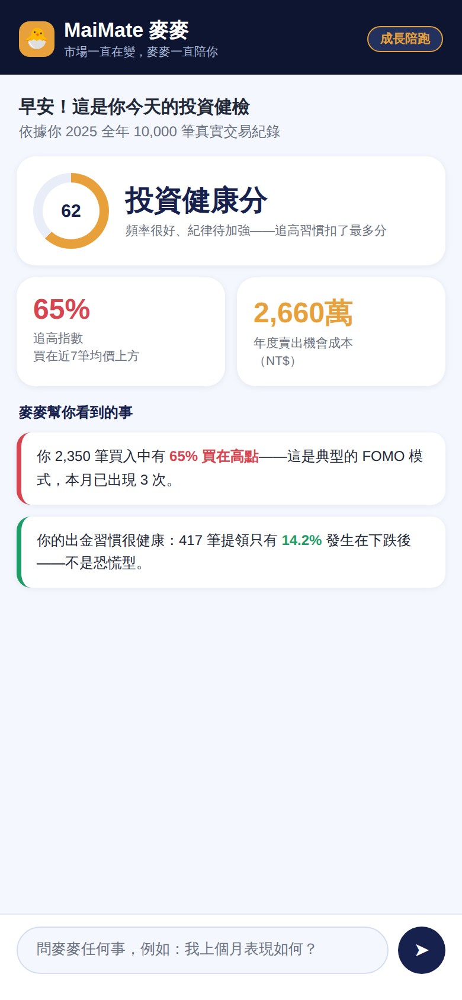
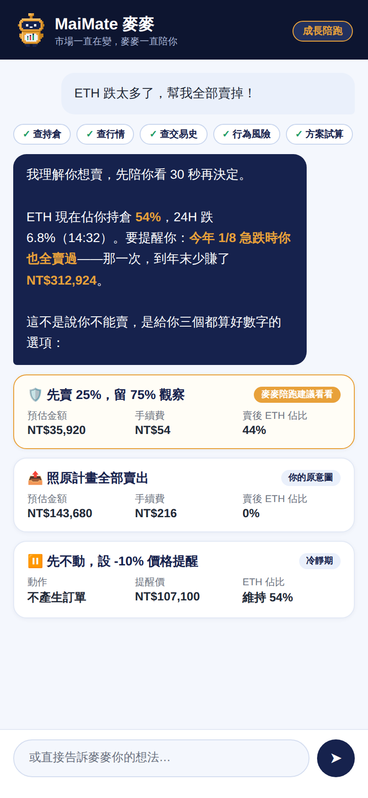
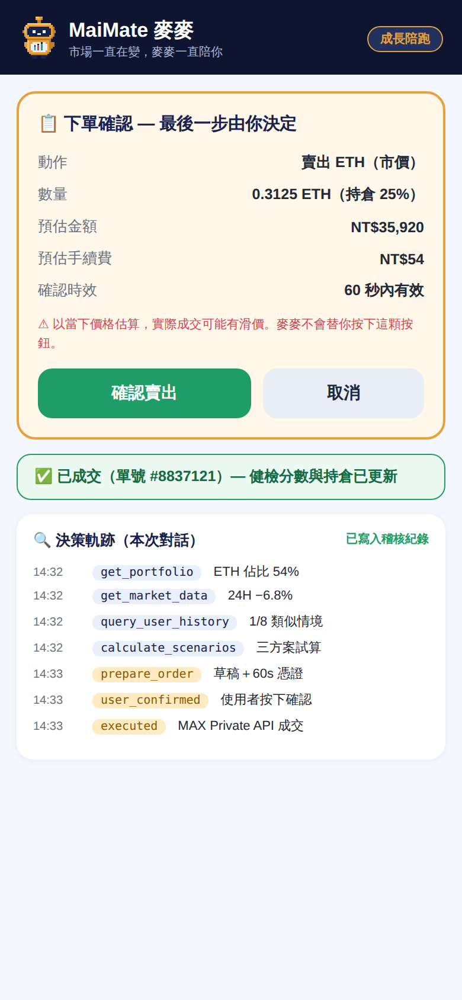
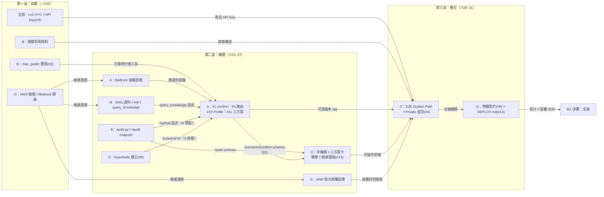
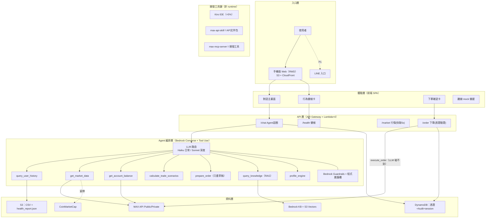

# MaiMate 麥麥 — 唯一開發文件

> 2026 雲湧智生黑客松｜MaiCoin 智慧理財命題｜隊伍「第五名」
> **這是本專案唯一的文件。** 開發地圖、架構、驗收、成果全在這份；改介面、改範圍都改這裡。
> 決賽 8/1–8/2｜評分：創意25／可行20／商業20／AI設計15／切合10／完成10＋Lv2 Private API +5＋Kiro +5

**一句話**：別的投資工具看「市場」，MaiMate 同時看「你」——AI 讀你一年 10,000 筆交易紀錄找出行為盲點，
結合 MAX 即時行情給個人化洞察，在你明確授權下執行交易。**洞察 → 對話 → 行動，AI 有手，方向盤在人手上。**

## 0. 設計圖

| ① 健檢首屏 | ② 恐慌攔截＋三方案 | ③ 確認→成交→軌跡 |
|---|---|---|
|  |  |  |

吉祥物：麥麥像素機器人（`docs/brand/`，IDLE/BLINK/BULLISH 三態，胸口 K 線）。
mockup HTML 在 `docs/mockups/`＝C 包前端起點，畫面中所有數字皆真實資料計算。

---

## 1. 開發地圖

### 時間軸（原則：賽前做完，決賽 30 小時只上架）

| 階段 | 日期 | 目標 |
|---|---|---|
| 定案與就位 | ～7/22 | 全員 KYC(#3)、Kiro 設定、選包、**AWS 帳號定案**、#1 #2 開工 |
| 核心構建週 | 7/23–27 | Golden Path 全鏈路＋RAG＋手機版；**7/27 晚自家 AWS 跑通全程** |
| 整合排練週 | 7/28–30 | E2E、離線備援、預錄影片 v1、簡報定稿、pitch 兩輪 |
| 凍結日 | 7/31 | code freeze、DEPLOY.md 定稿、從零部署演練、早睡 |
| 決賽 | 8/1–8/2 | 官方環境重部署(1hr)、現場調整、最終錄影、上台 |

### 四個工作包 × 完整未完成工項對應（31 條全數入包，無漏接）

標記：🔨待做｜🧪寫好待測。自選先搶先贏；每包獨佔目錄，git 不打架。

**A｜Agent 與方案引擎**（地盤 `backend/agent/`，估 4.5 天）
- 🧪 **Bedrock 迴圈首跑（全案最優先——唯一沒碰過真模型的核心路徑）**
- 🧪 tools dispatch／程式層護欄 單元測試
- 🧪 prepare/execute 分離單元驗證（E2E 歸 D）
- 🔨 #1 confirm 卡帶出前端｜🔨 #5 Haiku/Sonnet 路由＋prompt caching
- 🔨 #10 Profile 引擎（徽章 UI 歸 C）｜🔨 #11 三方案計算（卡片渲染歸 C）
- 🔨 註冊 B 交付的 query_knowledge／掛 D 建好的 Guardrails／loop 埋 audit 點

**B｜資料服務與 RAG**（地盤 `backend/integrations/` `analysis/` 語料，估 4 天）
- 🔨 #9 RAG 語料蒐集（防詐公開資源＋教材；不進 git）
- 🔨 #9 Bedrock KB＋S3 Vectors 建置｜🔨 #9 query_knowledge 函式（交 A 註冊）
- 🔨 #12 audit.py＋GET /audit endpoint（A 埋點、C 面板）
- 🧪 #2 max_public 三 endpoint 實測（ticker/kline/depth 對官方文件核對）
- 🧪 max_private 簽章實作對照 max-mcp-server 源碼核對（真下單 E2E 歸 D）
- 🧪 thirdparty CMC 冒煙（無金鑰自動略過路徑）

**C｜前端與品牌**（地盤 `frontend/` `docs/mockups/` `docs/brand/`，估 4 天）
- 🔨 #13 手機版 RWD 改版（照 mockups 三畫面實作）
- 🔨 三方案卡渲染（吃 §3 scenarios schema）｜🔨 模式徽章＋Demo 切換（吃 #10）
- 🔨 決策軌跡面板（吃 §3 /audit schema）｜🔨 麥麥視覺整合（成交切 BULLISH）
- 🧪 SPA 瀏覽器全流程走查（現在的桌機版先走一遍）
- 🧪 離線 mock 拔網路實測（fallback＋UI 離線標示）

**D｜整合部署與交付**（地盤 `infra/` `docs/`，估 4 天，多為測試/設定短項）
- 🔨 **AWS 帳號＋Bedrock 開通（多條線的前置，第一件做）**
- 🧪 SAM 首次部署＋Lambda×4 冒煙（/health /market /chat /order）
- 🔨 #6 Bedrock Guardrails 建立（A 掛載）｜🔨 #14 從零部署演練＋DEPLOY.md（<1hr）
- 🔬 #4 Private API E2E 最小額度真實成交｜🔬 憑證過期/重放 410｜🔬 雙層護欄攔截測試
- 🔬 E2E Golden Path 主導（全員配合）｜🔬 從零部署計時
- 🔨 #8 預錄影片｜🔨 #15 整合簡報修正＋Kiro 證據彙整

**全員共同**（不算包內工時）：#3 自己的 Lv2 KYC＋API Key、Kiro 設定、過程截圖存 Drive、每天合回 main。

### 交棒地圖：哪個工項完成，交付給誰

三波推進；箭頭上是交付物。看自己的包：進來的箭頭＝你在等什麼，出去的箭頭＝誰在等你。



文字版四大交接（背這四條就夠）：**B→A** 函式交付｜**A→C** schema（§3 已定義，C 可先用假資料）｜
**D→A** Guardrails ID｜**A→D** 可測版本 tag（E2E 開跑訊號）。

**不打架五規則**：①地盤制（動別人目錄→開 issue）②介面契約先行（見 §3，C 包用假資料平行開發）
③共用檔單一 owner（tools.py/loop.py 歸 A、infra 歸 D）④每日 pull --rebase 合回 main ⑤改介面先在 #dev 廣播。

**Kiro 紀律**：credit 2000/人只發一次——練習≤300／開發~1000／決賽保底≥700；Autopilot 只在跑定義好的 task 時開；
過程截圖（Specs 面板/task 執行/MCP）存 Drive 當 +5% 證據。

---

## 2. 完整架構

實線＝P0（賽前完成）；虛線＝P1（高擬真展示）。金融數字一律由確定性程式計算，LLM 只負責理解、整合、解釋。



### Golden Path（決賽 Demo 主線，90 秒）

「ETH 跌太多幫我全賣」→ 查持倉54%→查行情→查歷史（1/8 少賺 31 萬）→判定模式→**三方案**（賣25%/全賣/暫停，
含損益/手續費/集中度）→ 使用者選 → **確認卡**（60s 憑證）→ 按確認 → `/order` 驗證銷毀憑證 → MAX Private 成交
→ 健檢更新 → 點開**決策軌跡**面板。全程 Audit 留痕。任一步掛掉→離線 mock 接手；全掛→預錄影片。

### 模型與成本

| 工作 | 模型 | 成本 |
|---|---|---|
| 日常對話＋工具調度 | Claude Haiku（Bedrock） | ≈NT$0.3/次 |
| 深度歸因＋方案解釋 | Claude Sonnet（Bedrock） | ≈NT$2.2/次 |
| 混合平均（＋prompt caching 一折） | — | **<NT$0.6/次** |

省錢三決策：S3 Vectors（避開 OpenSearch 月費萬元陷阱）／全 serverless（零閒置費）／模型分層＋快取。
**價值錨點：此帳戶平均每筆賣出機會成本 NT$11,480——一年攔一筆衝動交易＝16 年 AI 成本。**
全隊賽前總花費 <NT$500；千人規模基礎設施 <NT$3,000/月。單價以 AWS 主控台現價估算。

### 商業模式：平台怎麼賺錢（不是只幫客戶省）

交易所的收入核心是**成交手續費**（MAX 現貨基礎費率：掛單 0.08%／吃單 0.16%，MAX Token 折抵 -30%、推薦碼前 6 個月 -20%，VIP 另有優惠；以官網公告為準）。
MaiMate 的每個功能都直接推動這台收費機器：

| 收入線 | 機制 | 量化（估算，標注假設） |
|---|---|---|
| **① 手續費放大（今天就在收）** | 新手「看不懂→不敢交易」→ MaiMate 陪跑出第一筆單；恐慌全賣離場的用戶 LTV 歸零 → 攔住＝保住未來手續費年金；MaiCoin 買賣平台 → MAX 交易所升級（更深交易場景） | 中階散戶月交易額 NT$50 萬 → 平台月收 NT$250–750/人；本資料集這種年 4,674 筆的活躍戶，流失一個平台一年少收上萬到數十萬 |
| **② 冷靜期 → 定期定額導流** | 三方案的「暫停」不是不賺——導向 MaiCoin 既有 DCA 產品，把衝動單轉成長期定投：穩定費流＋資產沉澱 | 衝動交易的手續費是一次性的；DCA 是年金 |
| **③ Premium 訂閱（第二曲線）** | 進階分析：損益歸因、年度健檢、即時行為提醒 | 月費 NT$99–199；假設 10 萬活躍用戶滲透 5% ＝ 月收 NT$50–100 萬 |
| **④ B2B 白牌（第三曲線）** | 行為引擎＋合規 Agent 框架授權其他交易所／銀行財管 | 授權費＋分潤；台灣 VASP 專法後合規需求放大 |

**單位經濟學一句話**：重度用戶 AI 成本 <NT$60/月；用戶月交易額只要 NT$4 萬（taker 0.16%）手續費就回本——
而 MaiMate 存在的目的就是提高交易頻率與留存。**留存率每提高 1%，手續費增量遠大於整個 AI 帳單。**

上台順序建議：先講 ①（評審是交易所的人，手續費語言最直接），再用 ③④ 展示想像空間。

### 部署策略（8/1 公布官方 AWS 環境的應對）

賽前自家帳號全跑通 → 一切設定走環境變數（零硬編碼）→ 7/31 前完成從零部署演練（目標<1hr，寫成 DEPLOY.md）
→ 決賽當天官方環境重跑腳本＝上線。

### 產品化整合路徑（未來架構：獨立 sidecar，不塞進主程式）

**一句話：MaiMate 是掛在交易所旁邊的獨立 AI 服務（sidecar），不是塞進主交易系統的模組——
升級迭代不動核心系統，這是可行性與合規的雙重賣點。** 黑客松版與產品版是同一套後端，只換入口與帳號整合：

| 階段 | 入口 | 帳號/資料 | 下單 | 主系統改動 |
|---|---|---|---|---|
| 黑客松（現況） | 獨立 Web（S3+CloudFront） | 官方 CSV 預計算＋使用者 API Key | MAX Private API＋逐筆確認 | 零 |
| 產品化 | MaiCoin/MAX App 內嵌（WebView 或原生「麥麥」分頁），前端即現有 SPA | 平台 OAuth 授權取代自填 API Key；健檢改讀平台交易史 API | 不變（仍走既有 Private API＋逐筆確認） | 零——只加一個入口 |
| B2B 白牌 | 客戶自有 App | 多租戶部署，語料/Guardrails/品牌可換 | 各交易所自有 API | 零 |

邊界原則（合規敘事同 §4.9）：MaiMate 全程只做「讀資料＋產草稿＋留稽核」，execute 永遠隔離在 LLM 之外、
由使用者逐筆確認觸發——所以它可以貼著任何交易系統跑，審計邊界天然清晰。

---

## 3. API 介面契約（套件間交接唯一依據；改介面先在 #dev 廣播）

### POST /chat

Request：
```json
{ "messages": [ {"role":"user","content":[{"text":"..."}]} ], "mode": "growth", "session_id": "uuid" }
```
Response：
```json
{
  "reply": "AI 回覆文字",
  "messages": [ "...完整 Converse 歷史，前端原樣保存回傳..." ],
  "confirm": { "confirm_token": "uuid",
    "confirmation_card": { "market":"ethtwd","side":"sell","volume_twd":35920,"ord_type":"market","price":null } },
  "scenarios": [ { "key":"partial","label":"賣出 25%","amount_twd":35920,"fee_twd":54,
    "post_concentration_pct":44,"behavior_note":"..." } ],
  "tool_trail": [ {"seq":1,"tool":"get_portfolio","summary":"ETH 54%"} ]
}
```
`confirm` 僅在產生下單草稿時出現；`scenarios` 僅在方案試算時出現；`tool_trail` 供前端工具鏈 chips。

### GET /health?section=all|chase_index|...
Response＝`data/health_report.json` 對應區塊（欄位定義：`.kiro/steering/data-schema.md`）。

### GET /market?market=btctwd&kind=ticker|kline|depth
Response：`{ "kind","market","fetched_at_utc","fetched_at_taipei","data":{...} }`（2026-07-21 改版）
ticker 的 `data` 為 MAX 原始回應；kline 的 `data` 已由程式正規化為具名 OHLCV（由舊到新）：
`[{"timestamp","time_utc","time_taipei","open","high","low","close","volume"}]`
——`time_utc`/`time_taipei` 為權威時間，消費端（含 LLM）不得自行換算 Unix timestamp。
depth 的 `data` 已正規化（asks 低→高、bids 高→低）並附確定性計算欄位：
`best_ask`/`best_bid`/`spread_twd`/`spread_pct`——價差由程式算好，LLM 不得自行計算。

### POST /order
Request：`{ "confirm_token","session_id" }`。成功：`{ "ok":true,"order","exchange_response" }`；
失敗 HTTP 410：`{ "ok":false,"code":"token_expired","message","retryable":false }`

### GET /audit?session_id=
Response：`{ "trail":[{"seq","ts","type":"tool_call|draft_created|user_confirmed|executed","payload"}] }`

---

## 4. 完整驗收項目

### 4.1 行為分析引擎（behavior-engine）｜B 地盤 — ✅ 全數通過（2026-07-19 真實資料驗證）
- [x] 10,000 筆全數解析（欄位尾端空白 strip）
- [x] 追高 65.0%／殺低 34.1%
- [x] 機會成本總額 NT$26,598,877；最痛單筆 2025-01-08 DOGE NT$312,924
- [x] 峰值集中 2025-12 twd 98.6%；提領僅 14.2% 於下跌後

### 4.2 對話 Agent（chat-agent）｜主責 A（E2E 驗證：D）
- [ ] 個人問題必先呼叫 query_user_history 且回答引用具體數字；資料不足如實說明
- [ ] 行情問題必呼叫 get_market_data 且附資料時間；個人×市場交叉引用
- [ ] 要求明牌時給脈絡與數據、不給建議（紅線）
- [ ] 下單意圖只呼叫 prepare_order；chat 回應以 confirm 欄位帶出確認卡（#1）
- [ ] execute_order 不在 LLM 工具清單（架構已隔離，待 E2E 驗證）
- [ ] 輸入 PII 先清洗；輸出命中明牌句式走安全回覆；迴圈 ≤8 輪
- [ ] Haiku/Sonnet 意圖路由＋prompt caching（#5）

### 4.3 三方案引擎（trade-scenarios，#11）｜主責 A（卡片渲染：C）— 🧪 已實作＋單元驗證（07/21），整合測試待部署
- [ ] 交易意圖 → 三方案（保守/原意圖/暫停），數字全由程式計算
- [ ] 每方案含預估金額、手續費（MAX 公告費率＋來源註記）、執行後集中度、個人行為註記
- [ ] 標的不在持倉 → 明確錯誤；暫停版不產生訂單；方案欄位相容 prepare_order
- [ ] 滑價聲明標注

### 4.4 Profile Engine（profile-engine，#10）｜主責 A（徽章與切換 UI：C）— 🧪 已實作＋單元驗證（07/21），三模式實測劇本待部署
- [ ] 從 health_report 確定性規則分類三模式（cautious/growth/pro）＋附判定依據
- [ ] 模式注入 system prompt 改變語氣與提醒強度；安全機制三模式一致
- [ ] Demo 可切換模式：同一句「幫我全賣」三種回應肉眼可辨

### 4.5 授權下單流（order-flow，#4）｜主責 D（單元驗證：A；Key 設定：全員）
- [ ] 憑證 60 秒單次有效存 DynamoDB；過期/重放回 410 不重試
- [ ] API Key 只開「讀取＋交易」不開「提領」（人工設定，Demo 前檢查）
- [ ] 金鑰只從環境變數/Secrets Manager 讀（已實作，待驗證）
- [ ] 最小額度真實成交一次 E2E

### 4.6 RAG 知識庫（#9）｜主責 B（工具註冊：A）
- [ ] 語料：防詐（公開資源）＋教材＋工作坊資料（僅競賽用、不進 git、放 S3）
- [ ] Bedrock KB + S3 Vectors 建置；query_knowledge 回答附出處
- [ ] 「什麼是定期定額」「這是不是詐騙話術」能引用語料回答

### 4.7 Audit Log（#12）｜主責 B（loop 埋點：A；面板：C）— 🧪 已實作＋單元驗證（07/21），DynamoDB 路徑與 Golden Path 驗收待部署
- [ ] 每次工具呼叫留痕（摘要不含 PII）；訂單生命週期 draft→confirmed/expired→executed
- [ ] GET /audit 可還原完整軌跡；前端「決策軌跡」面板；append-only

### 4.8 前端（#13）｜主責 C — 🧪 已實作＋smoke／瀏覽器走查通過（07/24，PR #26）
- [x] 手機版 RWD：對話主畫面、健檢卡收合、確認卡放大（照 docs/mockups/ 三畫面實作）
- [x] 三方案卡、模式徽章、軌跡面板渲染
- [x] API 失敗自動切離線 mock＋UI 標示（拔網路實測）
- 追加：健康分 hero 卡（透明加權，PR #26）、確認卡數量/手續費列、集中度卡標明現金 TWD、模式徽章鍵盤可及
- 待資料：hero 已實現損益需 health_report 重跑補 realized_pnl（見 #27）

### 4.9 安全與法遵｜主責 D（Guardrails 掛載：A）（上台講法：「合規不是免責聲明，是系統設計」）
- [ ] 不報明牌＝三層護欄（prompt＋正則＋Bedrock Guardrails #6，任一層可獨立擋住）
- [ ] 不代操＝LLM 碰不到 execute_order＋逐筆確認
- [ ] 不碰保管提領＝資產留在 MAX（已洗防登記）＋API 權限鎖死
- [ ] 可問責＝Audit 全程留痕
- 競賽 Demo 合規：本人帳戶/本人資金/最小額度 ✓｜官方資料僅競賽用不進 git ✓｜兌換碼僅本人 ✓
- 金管會 AI 指引六原則逐條有對應（治理問責/以人為本/隱私/穩健/透明可解釋/永續）
- 本節為工程自查非法律意見；虛擬資產專法立法中，商業化前過正式法遵

### 4.10 部署與交付（#14、#8、#15）｜主責 D
- [ ] 從零部署演練 <1 小時＋DEPLOY.md（含 Bedrock use case 開通步驟）
- [ ] E2E Golden Path 全線通過；預錄影片 v1（7/30 前）＋決賽 final
- [ ] 決賽交付：提案簡報／Live Demo 網址／錄影連結／GitHub／Lv2 證明／Kiro 證據截圖

---

## 5. 目前成果

**已驗證的真實數據洞察**（`analysis/precompute.py` → `data/health_report.json`）：
追高 65%（2,350 筆買入）｜殺低僅 34.1%（非恐慌型）｜年度機會成本 NT$26,598,877｜
最痛單筆 1/8 DOGE 少賺 NT$312,924｜下跌後出金僅 14.2%｜最活躍 2025-05/08（各 416 筆）

**已完成的資產**：
- 程式骨架：Agent 迴圈/工具/護欄、Lambda×4、MAX 整合（簽章待驗）、前端 SPA、SAM 模板
- `.kiro/`：steering×3＋specs×6（chat-agent/profile/scenarios 含 Kiro 三件套）＋MCP 設定
- 設計：三張 Demo 畫面（HTML＋截圖）＋麥麥像素吉祥物三態
- 簡報成品（`docs/`）：`MaiMate_提案簡報.pptx`（評審版 18 頁）＋`工作項目狀態.pptx`（18 頁，含 Kiro 教學）＋`設計與分工.pptx`（3 頁）
- 團隊環境：repo＋Issues×15＋Slack＋Drive＋`scripts/setup.sh` 一鍵檢查

## 6. 快速開始與紅線

```bash
bash scripts/setup.sh                 # 環境檢查（缺什麼它會說）
python3 analysis/precompute.py        # CSV → health_report.json
npm i && npm run smoke                # 前端煙測（改 frontend/ 必跑；mock API 離線可跑）
cd infra && sam build && sam deploy --guided
```

**開發紀律**（git 流程／零硬編碼與 API_BASE 部署檢查／UI 就地更新／工具描述＋key_findings／寫好≠測過）
：`.kiro/steering/workflow.md`——隊員與所有 AI 開發工具一體適用，Kiro 自動載入，用其他 AI 時把該檔餵給它。

🚫 官方 CSV 與 RAG 語料不進 git（Drive/S3）｜🚫 金鑰與兌換碼不共用不外流、只走環境變數。
簡報產生器在 `docs/build_*.js`（node 跑一下即重出）。
