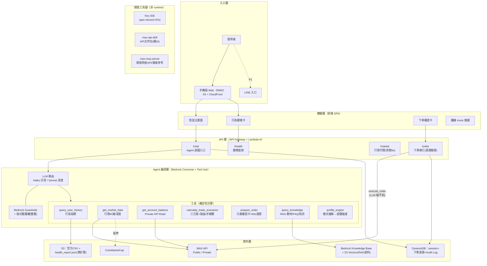
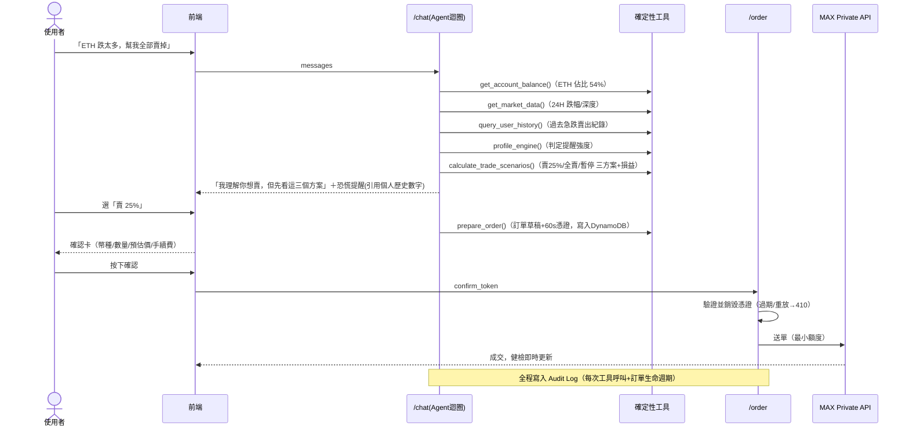

# MaiMate 完整系統架構

> 版本：2026-07-19（三案整合定案版）｜隊伍內部討論用
> 原則：**P0 賽前全部做完並在自家 AWS 跑通，決賽 30 小時只做重部署＋現場調整**

## 1. 產品定位

MaiMate 不是第三個 App，是嵌入 MaiCoin / MAX 既有生態的 **AI 互動層**：

```
使用者 ──> MaiMate（理解人・翻譯資料・提示風險・訂單草稿）──> MAX 交易與資料能力
                          │
                    安全治理（不報明牌・二次確認・Audit Log）
```

核心主張：**AI 有手，但方向盤永遠在使用者手上。**

## 2. 系統架構總圖

實線＝P0（賽前完成）；虛線＝P1（高擬真展示）；金融數字一律由確定性程式計算，LLM 只負責理解、整合、解釋。



**重要澄清（整合簡報要改的）**：`max-api-skill` 是給 AI 看的 API 文件包、`max-mcp-server` 是開發工具——兩者都在**開發工具鏈**，不在 runtime。產品實際下單走我們自己的 Private API 呼叫（`backend/integrations/max_private.py`）。

## 3. Golden Path 時序（決賽 Demo 主線，90 秒）



## 4. 元件明細與現況

| 層 | 元件 | 優先級 | 現況 | 程式位置 |
|---|---|---|---|---|
| 體驗 | 手機版 RWD 前端 | P0 | 桌機版已有，待改版 | `frontend/`（#13） |
| 體驗 | 離線 mock 備援 | P0 | ✅ 已內建 | `frontend/app.js` |
| API | Lambda×4 | P0 | ✅ 骨架完成 | `backend/handlers/` |
| Agent | Converse tool-use 迴圈 | P0 | ✅ 完成 | `backend/agent/loop.py` |
| Agent | Haiku/Sonnet 路由 | P0 | 待做 | #5 |
| Agent | 三方案生成 | P0 | 待做 | #11 |
| Agent | Profile 簡版（免問卷） | P0 | 待做 | #10 |
| Agent | prepare/execute 分離 | P0 | ✅ 完成 | `tools.py`+`order.py` |
| 資料 | 行為分析預計算 | P0 | ✅ 完成（真數字已驗證） | `analysis/` |
| 資料 | RAG Knowledge Base | P0（賽前建） | 待做 | #9 |
| 資料 | MAX Public/Private 串接 | P0 | 骨架有，待實測 | #2 #4 |
| 安全 | 程式層護欄（明牌攔截/PII） | P0 | ✅ 完成 | `guardrails.py` |
| 安全 | Bedrock Guardrails | P0 | 待做 | #6 |
| 安全 | Audit Log | P0 | 待做 | #12 |
| 部署 | SAM 一鍵部署 | P0 | ✅ 模板完成，待演練 | `infra/`（#14） |
| 入口 | LINE 隔日回顧 | P1 | 高擬真展示 | — |
| 體驗 | 三模式完整 UI | P1 | 只做提醒強度差異 | — |
| 學習 | 知識紅包/徽章 | P1 | 高擬真展示 | — |

## 5. 模型選擇與成本（評審點名題）

| 工作 | 模型 | 理由 |
|---|---|---|
| 日常對話＋工具調度 | Claude Haiku（Bedrock） | 迴圈一次 3–6 趟模型往返，速度與單價就是體驗；≈NT$0.3/次 |
| 深度歸因＋三方案解釋 | Claude Sonnet（Bedrock） | 推理較強，僅在需要時升級；≈NT$2.2/次 |
| 護欄 | Bedrock Guardrails | 模型層攔截，與程式層雙保險 |

prompt caching（system+工具定義）重複讀取一折。價值錨點：混合平均 <NT$0.6/次；此帳戶平均每筆賣出機會成本 NT$11,480——**一年攔下一筆衝動交易 = 16 年 AI 成本**。

## 6. 部署策略（決賽日最大變數的解法）

8/1 開幕公布「競賽專屬 AWS 環境」，可能須部署至主辦帳號。因此：

1. **賽前**：自家 AWS 帳號全鏈路跑通（含 Bedrock 開通、KB 建立）
2. **一切設定走環境變數**（modelId、金鑰、API base），零硬編碼
3. **7/31 前完成「從零部署」演練**：`sam build && sam deploy` → 環境變數 → 前端上傳 → 冒煙，目標 <1 小時，寫成 `DEPLOY.md` 照表操課
4. 決賽當天：官方環境重跑一次腳本＝上線

## 7. 資安設計要點

- **execute_order 不在 LLM 工具清單**——AI 只能產生草稿，真正送單由系統在使用者確認後觸發；憑證 60 秒單次有效
- API Key 只開「讀取＋交易」、不開「提領」；金鑰只存環境變數/Secrets Manager
- 官方 CSV 與 RAG 語料只放 S3/Drive，不進 git
- 雙層護欄獨立測試（任一層單獨也要能擋住明牌/PII）
- 法規面詳見 `docs/COMPLIANCE.md`
